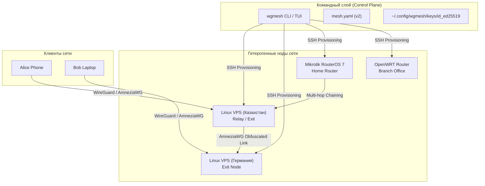
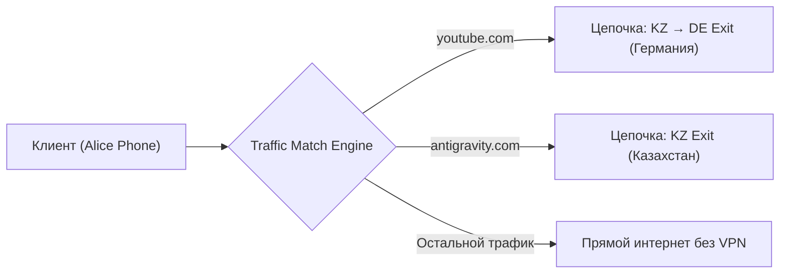

# Архитектура wgmesh

Документ описывает архитектурные принципы, подсистемы, модель данных и механизмы маршрутизации **wgmesh** — Zero-Server / Zero-Agent менеджера WireGuard & AmneziaWG mesh-сетей.

---

## 🏛️ 1. Обзор архитектуры и философии



### Ключевые принципы:
1. **Zero-Server & Zero-Agent**: Для работы сети не требуется разворачивать центральный сервер управления или фоновые демоны. Управление нодами осуществляется напрямую по **SSH** с использованием единственного выделенного ключа `~/.config/wgmesh/keys/id_ed25519`.
2. **Git-Centric Configuration**: Вся конфигурация сети хранится в версионируемом файле `mesh.yaml` (v2 schema).
3. **Multi-Hop Peer Policy Routing**: Предотвращение коллизий маршрутов WireGuard `AllowedIPs` в ядре Linux за счёт по-интерфейсной и по-пировой маршрутизации и TCP MSS Clamping.
4. **Domain/IP Split Tunneling**: Селективное распределение трафика по доменным спискам (`youtube.com` через Германию, рабочие порталы через Казахстан).
5. **Heterogeneous Platform Support**: Прямой провижининг платформ **Linux** (wg-quick / iptables), **Mikrotik RouterOS 7** (RouterOS CLI) и **OpenWRT** (UCI + fw4).

---

## 📐 2. Подсистемы и структуры данных

Репозиторий проекта организован следующим образом:

```
cmd/wgmesh/         Точка входа CLI / TUI (main.go)
internal/
  cli/              Cobra CLI команды (init, node, route, apply, doctor, export, git, tui)
  config/           YAML-модель данных (Mesh, Node, Route, Client, DomainList, TrafficMatch)
  drivers/          Драйверы платформ (Linux, Mikrotik RouterOS 7, OpenWRT, Rollback framework)
  export/           Реестр экспортеров (WireGuard, AmneziaWG, Sing-box JSON, Universal URIs, QR)
  mesh/             Ядро генерации планов, распределения Mesh IP и валидации графа
  tui/              Интерактивный Bubble Tea TUI (модальная система, редактор топологии)
  wg/               Генерация ключей WireGuard и AmneziaWG обфускации
configs/            Примеры конфигураций
scripts/            Установочный скрипт install.sh
```

### Модель данных (`mesh.yaml` v2)
См. файл [internal/config/types.go](file:///c:/iridi/wgmesh/internal/config/types.go):

- **`Node`**: Описывает участника сети (IP/домен, тип `linux|mikrotik|openwrt`, параметры SSH, статус `protected: true`, интерфейс WG, служебный `mesh_ip`).
- **`Route`**: Описывает цепочку хопов (`path: [client, kz-server, de-server]`), `exit_node`, привязку к клиентам `from`, условие отбора трафика `match` и поссылочные параметры обфускации AmneziaWG `link_obfuscation`.
- **`Client`**: Пользовательское устройство, с указанием ноды входа `ingress` и выделенного адреса в mesh-сети.
- **`DomainList`**: Список доменных имен (`domains`) и CIDR-подсетей (`ips`) для выборочного туннелирования.

---

## 🔀 3. Выборочная маршрутизация (Split Tunneling) и Multihop



### Избежание коллизий WireGuard `AllowedIPs`
Стандартный WireGuard при добавлении нескольких пиров с одинаковыми `AllowedIPs=0.0.0.0/0` на одном интерфейсе перезаписывает таблицы маршрутизации в ядре. **wgmesh** решает эту проблему:
1. Выделением служебной подсети `10.66.0.0/16` для связи нод в сети.
2. Использованием точечных маршрутов `/32` на промежуточных транзитных нодах (Relay).
3. Настройкой **TCP MSS Clamping** (`iptables -t mangle -A FORWARD -p tcp --tcp-flags SYN,RST SYN -j TCPMSS --clamp-mss-to-pmtu`), предотвращающего зависание TLS/HTTPS рукопожатий на промежуточных хопах из-за фрагментации пакетов.

---

## 🛡️ 4. Защита элементов и Диагностика (Doctor)

### Механизм `protected: true`
Для предотвращения случайного удаления или поломки опорных нод и инфраструктурных маршрутов в `Node` и `Route` поддерживается флаг `protected: true`:
- В CLI и TUI любые попытки удаления (`node remove`, `route remove`) или изменения (`route edit`) защищённого объекта запрашивают интерактивное подтверждение `(y/N)` с ярким предупреждением.
- В скриптах автоматизации подтверждение можно обойти флагом `--force` (`-f`).

### 🏥 wgmesh Doctor
Подсистема диагностики [internal/cli/doctor.go](file:///c:/iridi/wgmesh/internal/cli/doctor.go) выполняет 6 этапов проверки:
1. **Config Validation**: Синтаксис и отсутствие циклов в графе `mesh.yaml`.
2. **Security Hygiene**: Проверка наличия приватных ключей в открытом файле `mesh.yaml`.
3. **SSH Connectivity**: Проба TCP-подключения к порту SSH каждой ноды.
4. **Tools Audit**: Наличие `wireguard-tools` на Linux/OpenWRT или RouterOS 7 на Mikrotik.
5. **Port Probes**: Проверка портов прослушивания WG.
6. **Exit Internet Check**: Проверка реального выхода в интернет (`curl ifconfig.me`) с exit-нод.

---

## 📦 5. Реестр экспорта конфигураций и QR

Подсистема экспорта [internal/export/export.go](file:///c:/iridi/wgmesh/internal/export/export.go) генерирует клиентские профили в различных форматах:
- **WireGuard**: Стандартные `.conf` файлы.
- **AmneziaWG**: Конфиги с поссылочными заголовками обфускации (`H1-H4`, `S1-S4`, `Jc/Jmin/Jmax`).
- **Sing-box JSON**: Готовые конфигурационные файлы с запечёнными доменными правилами `route.rules`.
- **Universal URIs**: Однокликовые ссылки `sing-box://` и `wireguard://`.
- **ASCII QR**: Прямой рендеринг QR-кодов в терминале и TUI-интерфейсе.

---

## 🖥️ 6. Подсистема TUI (Bubble Tea)

TUI-интерфейс [internal/tui/app.go](file:///c:/iridi/wgmesh/internal/tui/app.go) построен на реактивном фреймворке **Bubble Tea** и **Lipgloss**:
- **Запуск без аргументов**: Запуск `wgmesh` без подкоманд автоматически открывает TUI.
- **100% покрытие функций**: Все операции (Bootstrap, Add/Edit Node & Route, Apply, Doctor, Export, QR, Git Commit/Push) доступны через модальные диалоги.
- **Модальное состояние**: Управление окнами описано в [internal/tui/modals.go](file:///c:/iridi/wgmesh/internal/tui/modals.go) с использованием реактивного конечного автомата.
